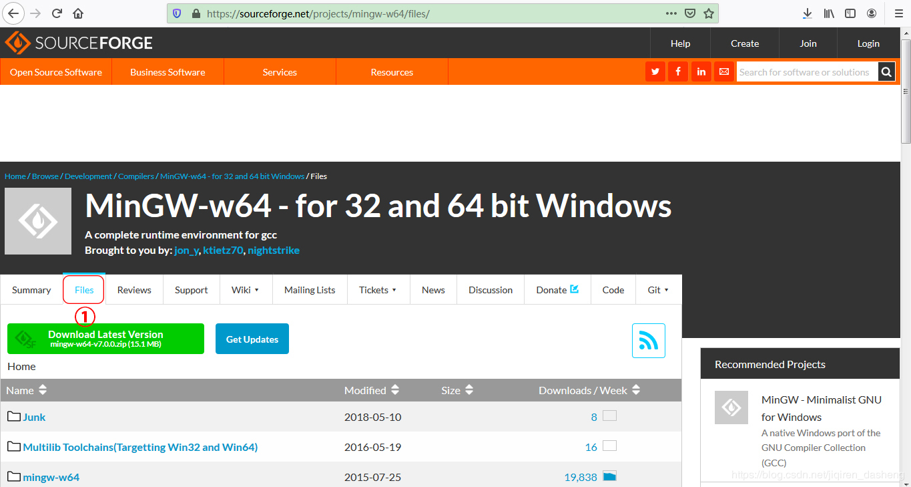
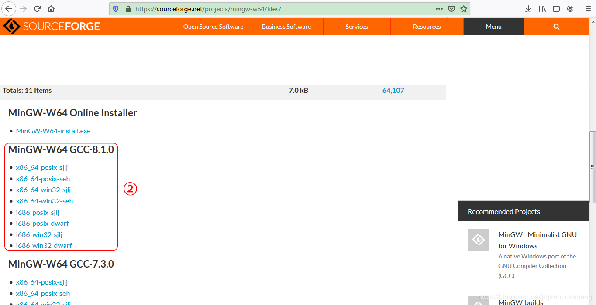
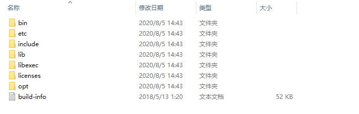
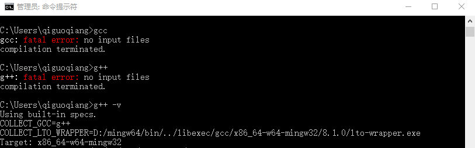

<div align="center" ><font size="70">Eigen优化入门</font></div>

# VS Code 开发环境配置
## 软件及其插件安装(windows)
1.安装 [Visual Studio Code](https://code.visualstudio.com/download)  
2.安装 VS Code中 C++ 插件，通过<kbd>Ctrl</kbd>+<kbd>Shift</kbd>+<kbd>X</kbd>打开插件窗口，搜索 C++ 关键词  
  

**NOTE:如有需要，可安装中文语言包和 文件传输插件sftp(用于在服务器和本地之间传输文件)，如下：**  
  
  

3.安装 c++ 编译器(MinGW-w64)  
1.安装包下载  
方法一：下载[Installer](http://www.mingw-w64.org/doku.php)  在线安装(费时)  

方法二：下载[离线包](https://sourceforge.net/projects/mingw-w64/files/)(较快)
点击[离线包下载](https://sourceforge.net/projects/mingw-w64/files/)进入 进入下图1后将页面往下滑到图2区域，点击所需离线包名称(参照方法一第三步标注)，完成下载操作。




解压得到二进制文件，文件结构如下：



2.环境变量配置  
<u>右键计算机→属性→高级系统设置→高级→环境变量</u>，然后鼠标双击系统变量中Path，或者选中后点击编辑，在变量值输入框的末尾输入英文分号后将MinGW-w64包目录下bin文件夹的全路径粘贴到后面，bin的后面有无斜杠均可；或者选择Path后新建，复制bin文件夹路径，如下图：


在window cmd中键入 gcc/g++ -v 查看编译器版本



**拓展阅读**：  
MinGW 的全称是：Minimalist GNU on Windows 。它实际上是将经典的开源 C语言 编译器 GCC 移植到了 Windows 平台下，并且包含了 Win32API ，因此可以将源代码编译为可在 Windows 中运行的可执行程序。而且还可以使用一些 Windows 不具备的，Linux平台下的开发工具。一句话来概括：MinGW 就是 GCC 的 Windows 版本 。
MinGW-w64 与 MinGW 的区别在于 MinGW 只能编译生成32位可执行程序，而 MinGW-w64 则可以编译生成 64位 或 32位 可执行程序。
正因为如此，MinGW 现已被 MinGW-w64 所取代，且 MinGW 也早已停止了更新，内置的 GCC 停滞在了 4.8.1 版本。  

4.CMake 和Make 安装(可选)    
    TODO

## VS Code调试环境配置
在VS Code的工程中(通常指一个文件夹或者workspace),通常需要包含c_cpp_properties.json、task.json、和launch.json 三个文件，如果已安装sftp插件，还会有sftp.json文件，如下图所示。在VS Code中，所有的设置都可以通过JSON文件来完成，下面我们将对这些文件进行配置，从而实现代码调试功能。

<center>

</center>

1.. c_cpp_properties.json( compiler path and IntelliSense settings )配置  
如果VS Code打开的文件夹中没有c_cpp_properties.json文件，可通过<kbd>Ctrl</kbd>+<kbd>Shift</kbd>+<kbd>P</kbd>调出code的指令窗口，键入`Edit Configurations`并选择对应编辑设置，本次我们使用一个新建的文件夹进行测试，发现code设置后该目录下生成了.vscode文件夹和c_cpp_properties.json文件，如下：  


c_cpp_properties.json文件设置内容如下，其中***includePath***为IntelliSense在搜索所包含的 头文件 时要使用的路径列表，此处可理解为 告诉 编辑器(code)去哪里找这些.h文件，从而完成代码自动补全和检查功能。***compilerPath***需要指定到前文安装的编译器(gcc/g++ etc).  
 
```json
{
    "configurations": [
        {
            "name": "Win32",
            "includePath": [
                "${workspaceFolder}/**"
            ],
            "defines": [
                "_DEBUG",
                "UNICODE",
                "_UNICODE"
            ],
            "compilerPath": "D:\\mingw64\\bin\\gcc.exe",
            "cStandard": "c11",
            "cppStandard": "gnu++14",
            "intelliSenseMode": "clang-x64"
        }
    ],
    "version": 4
}
```  

2.tasks.json( build instructions )配置  
通过<kbd>Ctrl</kbd>+<kbd>Shift</kbd>+<kbd>P</kbd>调出code指令窗口，键入`configure tasks`并选择对应编辑设置。  


tasks.json 内容设置如下，其中***command***为编译所需要的编译器(gcc/g++ etc),***args***为编译器编译时参数，在需要使用一些第三方头文件时，需要在此处通过`-I /path/include`进行指定，从而告诉编译器去哪里寻找对于头文件：    
```json
{
    "tasks": [
        {
            "type": "shell",
            "label": "C/C++: g++.exe build active file",
            "command": "D:\\mingw64\\bin\\g++.exe",
            "args": [
                "-g",
                "${file}",
                "-o",
                "${fileDirname}\\${fileBasenameNoExtension}.exe"
            ],
            "options": {
                "cwd": "${workspaceFolder}"
            },
            "problemMatcher": [
                "$gcc"
            ],
            "group": {
                "kind": "build",
                "isDefault": true
            }
        }
    ],
    "version": "2.0.0"
}
```  

3.launch.json( debugger setting )配置  
通过<kbd>Ctrl</kbd>+<kbd>Shift</kbd>+<kbd>P</kbd>调出code指令窗口，键入`open launch.json`并选择对应编辑设置。  


launch.json文件设置如下，其中`program`为生成的目标文件，`miDebuggerPath`指定系统中debugger路径：  

```json
{
    "version": "0.2.0",
    "configurations": [
        {
            "name": "g++.exe - 生成和调试活动文件",
            "type": "cppdbg",
            "request": "launch",
            "program": "${fileDirname}\\${fileBasenameNoExtension}.exe",
            "args": [],
            "stopAtEntry": false,
            "cwd": "${workspaceFolder}",
            "environment": [],
            "externalConsole": false,
            "MIMode": "gdb",
            "miDebuggerPath": "D:\\mingw64\\bin\\gdb.exe",
            "setupCommands": [
                {
                    "description": "为 gdb 启用整齐打印",
                    "text": "-enable-pretty-printing",
                    "ignoreFailures": true
                }
            ],
            "preLaunchTask": "C/C++: g++.exe build active file"
        }
    ]
}
```  

4.sftp.json配置(仅安装sftp插件的需要进行配置)  
通过<kbd>Ctrl</kbd>+<kbd>Shift</kbd>+<kbd>P</kbd>调出code指令窗口，键入`sftp :config` 并选择对应编辑设置。stfp.json设置如下：  
```json
{
    "name": "name tag",
    "host": "your server ip",
    "protocol": "sftp",
    "port": 22,
    "username": "your username",
    "password":"your password",
    "remotePath": "/home/yourPath/",
    "uploadOnSave": true,
    "ignore":[
        ".vscode",
        ".git",
        ".DS_Store",
        "**/build**"
    ]
}
```

**拓展阅读**  
预定义变量  
`${workspaceRoot}` -VSCode中打开文件夹的路径 the path of the folder opened in VS Code  
`${workspaceFolder}` -在VS Code中打开的文件夹的路径  
`${workspaceFolderBasename}`-在VS Code中打开的文件夹名称，不带任何斜杠（/）  
`${file}` -当前打开的文件  
`${relativeFile}` -相对于当前打开的文件workspaceFolder  
`${relativeFileDirname}` -相对于当前打开的文件的目录名workspaceFolder  
`${fileBasename}` -当前打开的文件的基本名称  
`${fileBasenameNoExtension}`-当前打开的文件的基本名称，没有文件扩展名  
`${fileDirname}`-当前打开的文件的目录名  
`${fileExtname}` -当前打开的文件的扩展名  
`${cwd}` -启动时任务运行器的当前工作目录  
`${lineNumber}` -活动文件中当前选择的行号  
`${selectedText}` -活动文件中的当前选定文本  
`${execPath}`-正在运行的VS Code可执行文件的路径  
`${defaultBuildTask}` -默认构建任务的名称  


## 编译原理  
### 编译原理   
### GCC编译器  
### CMake 与 Make  

## SIMD优化与NEON指令集

## Eigen 优化实例